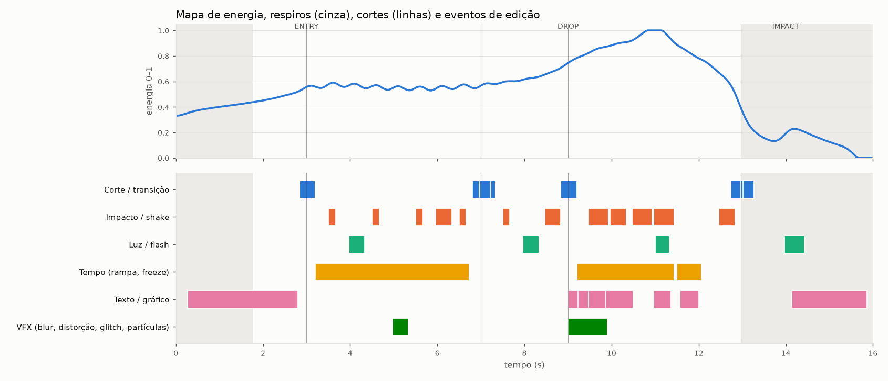

# Relatório — synthetic.mp4

> **VÍDEO SINTÉTICO DE TESTE gerado por tests/synth.py — não é o material do usuário (que não foi fornecido). Serve para validar cada detector contra gabarito conhecido.**

## 0. O que foi executado de fato (REGRA ZERO)

| etapa | estado |
|---|---|
| Inspeção do ambiente | executada — Linux-6.18.44-fc-v64-x86_64-with-glibc2.39, 4 CPUs, 15.7 GB, GPU NVIDIA: não |
| Análise de mídia/áudio/vídeo | executada (números abaixo são medidos) |
| Decisão + timeline JSON | executada |
| Script do After Effects | **gerado** (BUILD_CONDE_EDIT_v001.jsx); validado fora do AE: sintaxe ES3 OK, mock do object model 40 camadas, 2483 keys, 129 expressions, 0 falhas; expressions avaliadas: 129 propriedades, 3101 avaliações, 0 erros |
| Execução no After Effects | **não executada** — After Effects NÃO disponível neste ambiente: o JSX é gerado e validado (sintaxe ES3 + mock do object model), mas não executado no AE. |
| Render | **preview OpenCV/FFmpeg** (960×540) — aproximação da comp, não o render do AE |

## 1. Resumo e conceito visual

Edição **music** guiada pelo áudio (120.05 BPM, seções em 2.999s, 8.999s, 12.992s): 5 shots, cortes alinhados ao golpe, energia em arco (respiros → entradas → pico). A câmera é um rig de nulls que reage ao áudio só onde a seção pede; impactos escalam por tiers (small/medium/large) com vocabulário rotativo (BLUR_HIT, FLASH_CUT, FLASH_PUNCH, LIGHT_BLOOM, PUNCH_SHAKE, ROT_KICK, ZOOM_THROUGH); transições derivam do movimento do plano; texto ocupa o espaço negativo medido; uma única cor de acento (#ef9242, derivada do material) une brackets, linhas, anéis e partículas. Cada efeito tem um porquê registrado na timeline.

## 2. Especificações

```text
Resolution: 1280x720 (PAR 1.0, AR 1.7778)
FPS:        fonte 30 (30/1) → comp 30
Duration:   16.000 s = 480 frames (saída: 480 frames)
Codec:      h264 High yuv420p 8-bit, 0.9 Mb/s
Audio:      aac 48000 Hz, 2 canais (stereo), -13.6 LUFS, LRA 7.5 LU, true peak 0.2 dBTP
```

### Áudio (FASE 5)

- Tempo: **120.05 BPM** (periodicidade 0.813, confiança 1.0); downbeats com confiança 0.88
- Modo detectado: **music** — periodicidade rítmica 0.81 (conf. tempo 1.00); fração com atividade vocal (heurística) 0.00
- Marcadores: BEAT 25, DOWNBEAT 8, DROP 1, ENTRY 1, HAT 16, IMPACT 1, KICK 21, ONSET 17, RISER 1, SILENCE 2, SNARE 4
- Frequência dominante: 64.6 Hz · pico RMS -1.27 dB · limiar de silêncio -44.1 dB
- Seções: 2.999s (novelty 0.772), 8.999s (novelty 0.754), 12.992s (novelty 1.0)

### Shots (FASE 4)

| shot | início–fim | duração | movimento | câmera | sujeito | cor | energia | potencial |
|---|---|---|---|---|---|---|---|---|
| SHOT_001 | 00:00.000–00:03.000 | 3.000s | LOW | estática | região saliente (esquerda) | laranja #805129 | 0.461 | PUNCH_IN_CUTS, COLOR_FIX |
| SHOT_002 | 00:03.000–00:07.067 | 4.067s | HIGH | pan → direita | região saliente (centro) | azul #31497e | 0.55 | SPEED_RAMP, WHIP_SOURCE, COLOR_FIX |
| SHOT_003 | 00:07.067–00:09.000 | 1.933s | HIGH | tilt ↑ cima | região saliente (centro baixo) | verde #327f39 | 0.712 | SPEED_RAMP, WHIP_SOURCE |
| SHOT_004 | 00:09.000–00:13.000 | 4.000s | HIGH | pan ← esquerda | região saliente (direita) | magenta #813074 | 0.883 | SPEED_RAMP, WHIP_SOURCE, COLOR_FIX |
| SHOT_005 | 00:13.000–00:16.000 | 3.000s | LOW | estática | região saliente (direita) | azul #151d43 | 0.254 | PUNCH_IN_CUTS, COLOR_FIX |

Cortes: 4 · flashes/transientes rejeitados como corte: 1 · análise densa adaptativa em 197/480 frames (strides {1: 112, 2: 118, 4: 80, 8: 170}) · representação frame a frame em `frames.csv`.

### Mapa de energia (FASE 6)



| t (s) | 0 | 1 | 2 | 3 | 4 | 5 | 6 | 7 | 8 | 9 | 10 | 11 | 12 | 13 | 14 | 15 |
|---|---|---|---|---|---|---|---|---|---|---|---|---|---|---|---|---|
| energia | 0.33 | 0.40 | 0.45 | 0.56 | 0.57 | 0.55 | 0.55 | 0.57 | 0.62 | 0.74 | 0.88 | 1.00 | 0.78 | 0.37 | 0.19 | 0.13 |

## 3. Timeline (eventos principais)

| tempo | frame | evento | ação | intensidade | sync de áudio | preview |
|---|---|---|---|---|---|---|
| 00:00.267 | 8 | EVT_006 TEXT/CHAR_CASCADE | Text animator (Range Selector) + entrada char_cascade + saída por caractere | 0.5 | BEAT (saída) @ 88 | pending |
| 00:02.833 | 85 | EVT_007 TRANSITION/ZOOM_THROUGH | Zoom-through + Lens Distortion (Optics Compensation) | 0.734 | DOWNBEAT/ENTRY/KICK @ 90 | OK |
| 00:03.200 | 96 | EVT_010 SPEED_RAMP/RAMP_002 | Time Remap + Speed Ramp + Force Motion Blur nas velocidades > 150% | 0.71 | KICK @ 120 | OK |
| 00:03.500 | 105 | EVT_011 SHAKE/MICRO_SHAKE | Micro-shake | 0.2 | KICK @ 105 | OK |
| 00:03.967 | 119 | EVT_012 FLASH/FLASH_PUNCH | Scale Punch + Exposure Flash + Position Shake | 0.59 | KICK @ 120 | OK |
| 00:04.500 | 135 | EVT_013 SHAKE/MICRO_SHAKE | Micro-shake | 0.2 | KICK @ 135 | OK |
| 00:04.967 | 149 | EVT_014 BLUR/BLUR_HIT | Scale Punch + Directional Blur + Directional Shake | 0.65 | KICK @ 150 | OK |
| 00:05.500 | 165 | EVT_015 SHAKE/MICRO_SHAKE | Micro-shake | 0.2 | KICK @ 165 | OK |
| 00:05.967 | 179 | EVT_016 PUNCH/ROT_KICK | Scale Punch + Rotation Kick + Directional Shake | 0.592 | KICK @ 180 | OK |
| 00:06.500 | 195 | EVT_017 SHAKE/MICRO_SHAKE | Micro-shake | 0.2 | KICK @ 195 | OK |
| 00:06.800 | 204 | EVT_018 CUT/MICRO_SYNC | Micro time-warp neutro | 0.2 | HIT @ 210 | OK |
| 00:06.967 | 209 | EVT_019 TRANSITION/FLASH_CUT | Flash de luz no corte + Shake leve | 0.74 | DOWNBEAT/KICK/RISER @ 210 | OK |
| 00:07.500 | 225 | EVT_021 SHAKE/MICRO_SHAKE | Micro-shake | 0.2 | KICK @ 225 | OK |
| 00:07.967 | 239 | EVT_022 FLASH/FLASH_PUNCH | Scale Punch + Exposure Flash + Position Shake | 0.466 | KICK @ 240 | OK |
| 00:08.467 | 254 | EVT_023 SHAKE/SHAKE_ONLY | Position Shake | 0.471 | KICK @ 255 | OK |
| 00:08.833 | 265 | EVT_024 TRANSITION/ZOOM_THROUGH | Zoom-through + Lens Distortion (Optics Compensation) | 0.846 | DOWNBEAT/DROP/KICK @ 270 | OK |
| 00:09.000 | 270 | EVT_027 GRAPHIC/BRACKETS | Brackets rastreados + Trim Paths draw-on + Scale pop | 0.5 | HIT @ 270 | pending |
| 00:09.000 | 270 | EVT_028 PARTICLE/SPARK_BURST | Explosão de partículas no sujeito | 0.945 | DROP/KICK @ 270 | pending |
| 00:09.200 | 276 | EVT_029 SPEED_RAMP/RAMP_001 | Time Remap + Speed Ramp + Force Motion Blur nas velocidades > 150% | 0.71 | KICK @ 300 | OK |
| 00:09.233 | 277 | EVT_030 TEXT/IMPACT | Text animator (Range Selector) + entrada impact + saída por caractere | 0.5 | DROP @ 270 | pending |
| 00:09.467 | 284 | EVT_031 PUNCH/PUNCH_SHAKE | Scale Punch + Position Shake | 0.729 | KICK/SNARE @ 285 | OK |
| 00:09.467 | 284 | EVT_032 GRAPHIC/RING_BURST | Anel expandindo do sujeito | 0.7 | HIT @ 284 | pending |
| 00:09.967 | 299 | EVT_033 SHAKE/SHAKE_ONLY | Position Shake | 0.71 | KICK @ 300 | OK |
| 00:10.467 | 314 | EVT_034 SHAKE/SHAKE_ONLY | Position Shake | 0.75 | KICK/SNARE @ 315 | OK |
| 00:10.967 | 329 | EVT_035 PUNCH/PUNCH_SHAKE | Scale Punch + Position Shake | 1.0 | FLASH_VISUAL/KICK @ 330 | OK |
| 00:10.967 | 329 | EVT_036 GRAPHIC/RING_BURST | Anel expandindo do sujeito | 0.7 | HIT @ 329 | pending |
| 00:11.000 | 330 | EVT_037 FLASH/LIGHT_BLOOM | Glow acompanhando a luz da cena | 0.5 | — @ — | pending |
| 00:11.500 | 345 | EVT_038 FREEZE/FREEZE_001 | Freeze (Time Remap HOLD) + Push-in 100→110% + Brackets no sujeito + Release: punch + flash + shake | 0.751 | KICK/SNARE @ 345 | OK |
| 00:11.567 | 347 | EVT_039 GRAPHIC/BRACKETS | Brackets rastreados + Trim Paths draw-on + Scale pop | 0.5 | HIT @ 347 | pending |
| 00:12.467 | 374 | EVT_040 PUNCH/ROT_KICK | Scale Punch + Rotation Kick + Directional Shake | 0.672 | KICK/SNARE @ 375 | OK |
| 00:12.733 | 382 | EVT_041 CUT/MICRO_SYNC | Micro time-warp neutro | 0.2 | HIT @ 389 | OK |
| 00:12.967 | 389 | EVT_042 CUT/HARD_CUT | Corte seco | 0.637 | DOWNBEAT/SILENCE @ 389 | OK |
| 00:13.967 | 419 | EVT_045 FLASH/FLASH_PUNCH | Scale Punch + Exposure Flash + Position Shake | 0.72 | IMPACT/KICK @ 420 | OK |
| 00:14.133 | 424 | EVT_046 TEXT/WORD_REVEAL | Text animator (Range Selector) + entrada word_reveal + saída por caractere | 0.5 | IMPACT @ 420 | pending |

Detalhe de cada evento (DETECTOR, PARAMETERS, EASING, WHY, A/B, VALIDATION): **TIMELINE.md**.

### Edição base (FASE 9/10)

- 4 cortes; a ≤1 frame de um golpe: 3 antes → **4 depois** da microedição (offset médio 0.75 → 0.0 frames).
- {'op': 'MICRO_SYNC', 'cut_src_frame': 212, 'from_frame': 212, 'to_frame': 210, 'shift': -2, 'window': [204, 220], 'speeds': [1.333, 0.8]}
- {'op': 'MICRO_SYNC', 'cut_src_frame': 390, 'from_frame': 390, 'to_frame': 389, 'shift': -1, 'window': [382, 398], 'speeds': [1.143, 0.889]}
- Sem efeitos, a edição continua funcionando? Os cortes caem no golpe, as rampas são neutras (a sincronia volta na borda de cada janela) e os freezes devolvem o tempo — sim no nível de ritmo; o julgamento estético final exige assistir ao render do AE.

## 4. Sistemas criados

- Câmera: CAMERA_MASTER › POSITION (X/Y separados) › ROTATION › ZOOM (centro = CAMERA_FOCUS no sujeito) › SHAKE.
- Shake procedural por marcadores (amp, freq, decay, rot, direção, bias) + shake ambiente por faixa de energia.
- Impactos: tiers small/medium/large, 7 receitas, orçamento por faixa, sem repetir receita seguida.
- Transições derivadas do movimento (whip na direção do conteúdo, zoom-through em entradas/drops, flash cut, glitch) com teste A/B.
- Tempo: micro-sync de cortes (±2 frames), speed ramps neutras que levam o hit visual ao golpe, freeze com release.
- Texto: placeholders no espaço negativo (grid 4×3), Range Selector por caractere/palavra, placa de legibilidade quando falta espaço.
- Gráficos: brackets presos ao track 2D do sujeito, anéis de impacto, linhas de acento — mesma cor e espessura.
- VFX: flash tingido pela cena, glow que acompanha a luz real, blur direcional, distorção curta, RGB split, partículas físicas.
- Cor: correção por shot (Exposure por canal, linear) ABAIXO do look (contraste, vibrance, vinheta).
- Áudio → dados: graves/médios/agudos/amplitude assados por frame; gates alternam UM canal reativo por seção.
- Controladores: CTRL_MASTER com 10 sliders de intensidade; CTRL_CAMERA, CTRL_AUDIO, CTRL_VFX.
- Organização: pastas 00_MASTER…11_EXPORT, 40 camadas nomeadas, labels por grupo, comentário com a função de cada camada.

## 5. Automações

- Análise (Python/FFmpeg/OpenCV): ffprobe+EBU R128, onsets SuperFlux, beat tracking por programação dinâmica, cortes por histograma com rejeição de flash, movimento afim LK+RANSAC, passada adaptativa, tracking do sujeito.
- Decisão: motor que converte análise em eventos com keys Bezier (speed/influence) e expressions.
- Geração: BUILD_*.jsx autocontido que monta o projeto inteiro, salva com versão incremental e escreve BUILD_LOG + checklist.
- Validação sem AE: sintaxe ES3, mock do object model, avaliação de todas as expressions e comparação numérica com o preview.
- Preview: segundo interpretador da timeline com verificação automática frame a frame dos eventos.
- Ferramentas para rodar no AE: ae/tools/profile_systems.jsx (FASE 38) e ae/tools/toggle_heavy.jsx (FASE 37).

## 6. Otimizações e profiling

| etapa | tempo (s) |
|---|---|
| 0_ambiente | 0.12 |
| 1-6_analise | 8.19 |
|    media | 0.31 |
|    video_pass1 | 2.21 |
|    audio | 0.46 |
|    video_pass2_adaptive | 5.15 |
| 7-56_decisao | 0.1 |
| 63_preview_render | 54.98 |
| 63_preview_debug | 55.81 |
| 49_jsx+validacao | 0.35 |
| total | 119.9 |

- Passada 2 adaptativa: análise densa só onde importa (197/480 frames); fluxo denso e rostos em meia resolução (profiling apontou Haar + Farneback como 76% do tempo: 17,3 s → 5,5 s no clipe de teste).
- No AE: efeitos caros (distorção, glitch, RGB split, partículas) em camadas cortadas no evento — custo zero fora dele.
- Dados de áudio por frame aplicados com setValuesAtTimes (lote), não key a key.
- Profiling de render no AE não pôde ser medido aqui (sem AE): ae/tools/profile_systems.jsx renderiza janelas críticas desligando cada sistema e grava o custo de cada um em CSV.

## 7. Qualidade (FASES 39–45, 57–59) e verificação frame a frame (FASE 40)

- Repetição: MICRO_SHAKE 5, FLASH_PUNCH 3, SHAKE_ONLY 3, ZOOM_THROUGH 2, ROT_KICK 2, MICRO_SYNC 2, PUNCH_SHAKE 2, CHAR_CASCADE 1, BLUR_HIT 1, FLASH_CUT 1, SPARK_BURST 1, IMPACT 1, LIGHT_BLOOM 1, FREEZE_001 1, HARD_CUT 1, WORD_REVEAL 1
- Densidade visual: média 1.91/s, máx 4.0/s; faixas {'LOW': 0.198, 'MEDIUM': 0.11, 'HIGH': 0.583, 'EXTREME': 0.108}; correlação com a energia r = 0.556
- Respiros: 2 zonas, 30% do tempo, densidade interna 0.78/s
- Teste de pausa: maior trecho com efeitos empilhados 0.43 s
- Teste sem áudio: 13 eventos visuais, 100% na grade de beats, intervalo médio 0.917 s (CV 0.307)
- Teste só com áudio: 12/13 golpes fortes representados (92%); sem representação: frames [360]
- Silhueta: TEXT_001 0%, TEXT_002 0%, TEXT_003 0%
- Verificação no preview renderizado: **25/25** eventos aprovados; frames pretos inesperados: 0; tiras de revisão em `frames/verify_*.jpg`.
  - ? EVT_022 FLASH_PUNCH: ['zoom do punch já visível no frame do golpe'] — não mensurável na imagem (registrado, não contado como aprovado)
  - ? EVT_045 FLASH_PUNCH: ['zoom do punch já visível no frame do golpe'] — não mensurável na imagem (registrado, não contado como aprovado)

### Checklist FASE 64 (executado no mock; repetir no AE via BUILD_LOG)

```text
CHECKLIST (FASE 64)
[x] resolução 1280x720
[x] FPS 30
[x] duração 480 frames
[x] nenhum asset ausente
[x] nenhuma expression quebrada (129 verificadas)
[x] motion blur da comp ligado
[x] áudio presente
[x] nenhuma falha de construção
```

## 8. Problemas e limitações

- After Effects indisponível neste ambiente: o projeto .aep NÃO foi construído nem renderizado aqui; o JSX foi validado por mock (que reflete o conhecimento da API, não o AE real). Rode o BUILD_*.jsx e leia o BUILD_LOG.
- Índices de parâmetros de alguns efeitos nativos (Exposure, Glow, Turbulent Displace, Shift Channels, Drop Shadow, CC Force Motion Blur) seguem a ordem documentada/conhecida, mas precisam de confirmação no BUILD_LOG.
- Rotoscopia não automatizada (exige Roto Brush/IA de segmentação): parallax real de foreground/background não foi feito; a profundidade 2.5D vem só da hierarquia de câmera e dos gráficos.
- 3D Camera Tracker e planar tracking não são scriptáveis de forma confiável: o tracking é 2D (LK) calculado no pipeline.
- Textos são placeholders (sem transcrição/roteiro): forneça `text.copy` no config para o motor posicionar a copy real.
- Preview é aproximação (Pixel Motion → mistura de frames; Glow/Turbulent/Lens → equivalentes OpenCV; fonte DejaVu).
- Detecção de voz é heurística (sem modelo de ML); confianças de classificação são margens heurísticas.
- RAMP_001: slow-motion de 50% em footage de 30 fps exige interpolação (Pixel Motion) — verificar artefatos de borda.
- RAMP_002: slow-motion de 50% em footage de 30 fps exige interpolação (Pixel Motion) — verificar artefatos de borda.

## 9. Arquivos

- `analysis.json` — análise completa (mídia, áudio, shots, amostras densas, track, energia)
- `frames.csv` — representação temporal FRAME 000000…N
- `frames/` — contact sheets, frames críticos e tiras de verificação
- `timeline.json` — timeline machine-readable (FASE 51)
- `TIMELINE.md` — timeline legível (FASE 7/67)
- `ae/BUILD_CONDE_EDIT_v001.jsx` — script do After Effects
- `ae/MOCK_BUILD_LOG.txt` — log do build no mock
- `PREVIEW.mp4` — render de preview
- `energy_timeline.png`
- `quality.json`
- `environment.json`